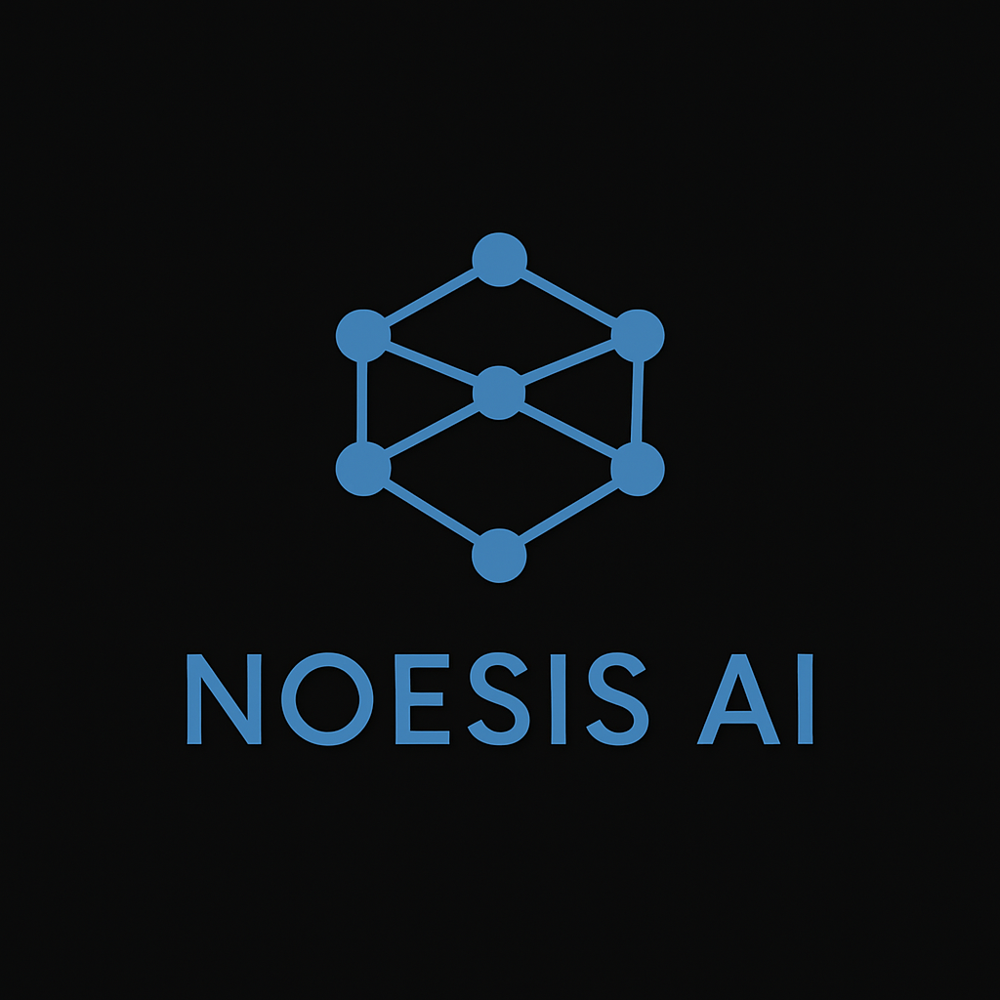

# Noesis AI

**Software and AI, built in Milan.**

[noesisai.it](https://noesisai.it)

---

Noesis AI is an independent software and AI holding from Milan. We design and ship products — some commercial, some open source — each one built to be **fast, honest, and genuinely useful**.

We build the tools we wanted ourselves. They look nothing alike on purpose: every product wears the design and the voice its users deserve. What they share is the way they are built.

- **Fast** — native where it matters, no runtime tax. Our software opens instantly and stays out of the way.
- **Honest** — no dark patterns, no hidden telemetry, no second subscription. What the code does is what we say it does.
- **Useful** — each product solves a real problem we actually had.

## Products

| Project | What it is | Links |
| --- | --- | --- |
| **Get It.** | A study companion that turns a PDF into a measurable mastery map. | [getit.noesisai.it](https://getit.noesisai.it) · [source](https://github.com/beltromatti/get-it) |
| **Droovy** | The operating system for modern driving schools — scheduling, payments, live GPS. | [droovy.it](https://droovy.it) |
| **Siever Mail** | A fast, private, native desktop email client. Local-only, zero trackers. | [sievermail.noesisai.it](https://sievermail.noesisai.it) · [source](https://github.com/beltromatti/siever-mail) |
| **Super Codex** | An unofficial fork of OpenAI Codex: multi-account ChatGPT and one-command local models. | [supercodex.noesisai.it](https://supercodex.noesisai.it) · [source](https://github.com/beltromatti/supercodex) |
| **ShadowSSH** | A fast, lightweight, private SSH client — real terminal, SFTP editor, live monitor. | [shadowssh.noesisai.it](https://shadowssh.noesisai.it) · [source](https://github.com/beltromatti/ShadowSSH) |
| **AgentChain** | A layer-1 blockchain written from scratch in C. Proof of Sustained Availability. | [agentchain.noesisai.it](https://agentchain.noesisai.it) · [source](https://github.com/beltromatti/agentchain) |

## Team

Founded by **Mattia Beltrami** and **Filippo Di Fronzo**, Computer Engineering at Politecnico di Milano.

Milano · Italia · <a href="https://noesisai.it">noesisai.it</a>

